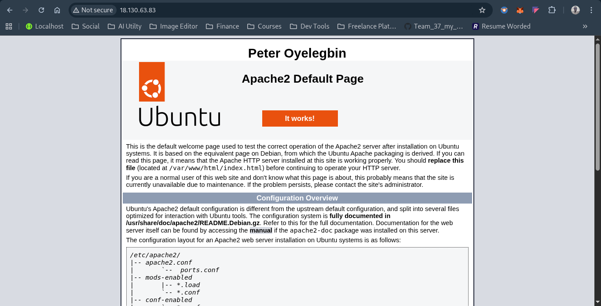
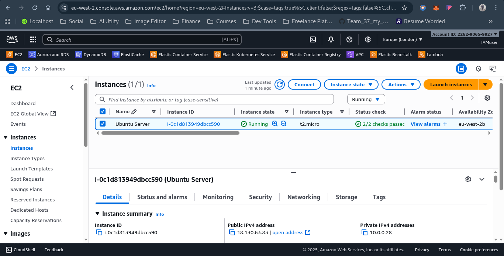

# Month 3 (Assignment 3)
## Instruction
1. Launch an Ubuntu EC2 instance (stay on free tier!). Allow SSH (port 22) and HTTP (port 80) in the security group.

2. SSH into your instance from your local machine. 

3. Install Apache and edit the default web page (/var/www/html/index.html) to display your name.

4. Open your browser and enter the public IP of the EC2 instance.

5. Delete your instance!!!

## Result
* Submit a Screenshot of your Apache page in the browser with your name displayed on the screen, and your IP address in the search/query bar.

* Submit a Screenshot of your running EC2 instance in the AWS console.

