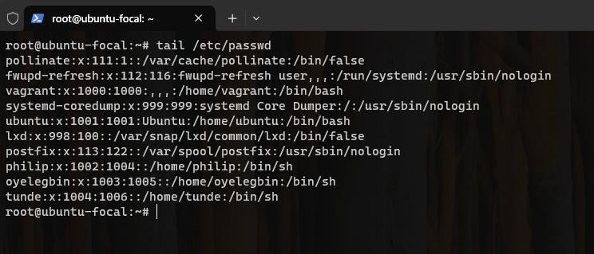
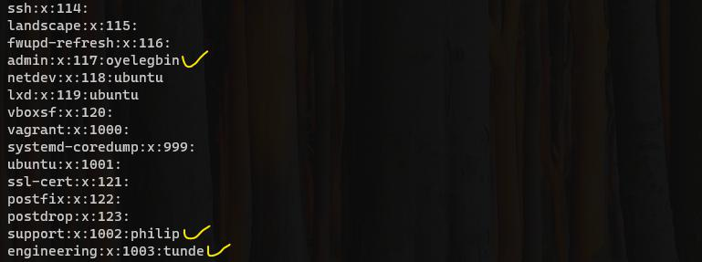
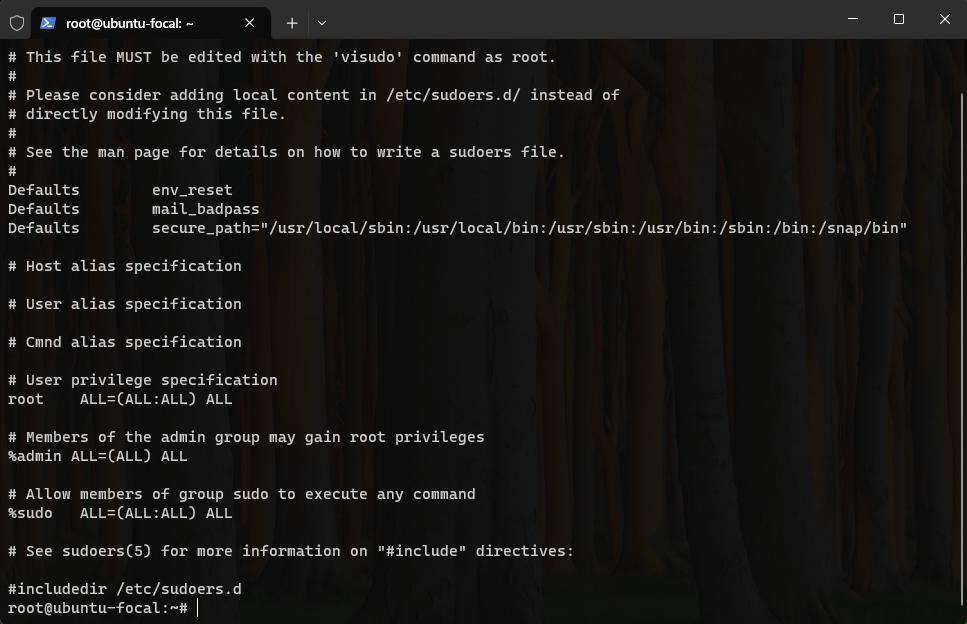

# Month 1 (Assignment 3)
**Instruction:**
1. Create 3 groups – admin, support & engineering and add the admin group to sudoers.
2. Create a user in each of the groups.
3. Generate SSH keys for the user in the admin group
4. Submit the contents of /etc/passwd, /etc/group, /etc/sudoers

**Result:**
1. I noticed the group admin is an existing group, hence I created 2 groups – support & engineering and using the command `groupadd "group_name"`.

2. I added the admin group to sudoers using the command `visudo` as a root user.

3. I created the user (philip, oyelegbin and tunde) using the command `useradd "user_name"` and assign them to groups using the command `usermod -G "group_name" "user_name"`

4. I loggedin to the "oyelegbin" user using the command `sudo login oyeelgbin` to generated an SSH keys for oyelegbin using the command `sudo ssh-keygen` who is assigned to the admin group.

5. Below are the file links to the contents of /etc/passwd, /etc/group, /etc/sudoers
  - contents of /etc/passwd
    

  - contents of /etc/group
    

  - contents of /etc/sudoers
    
