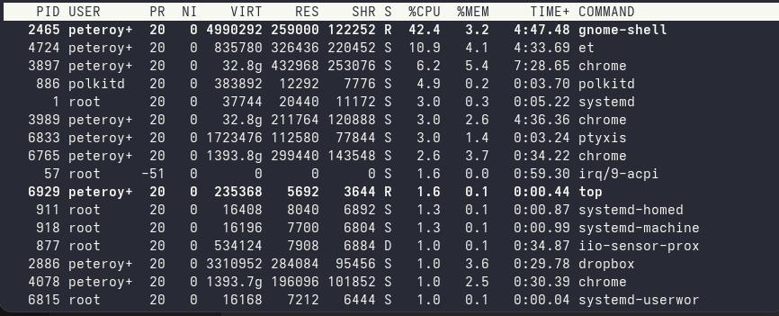
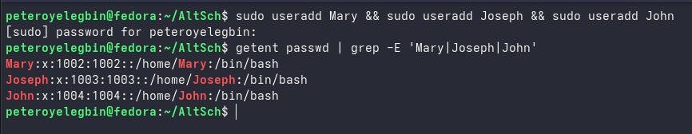
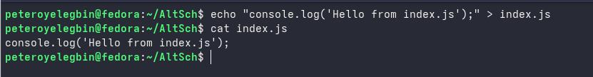
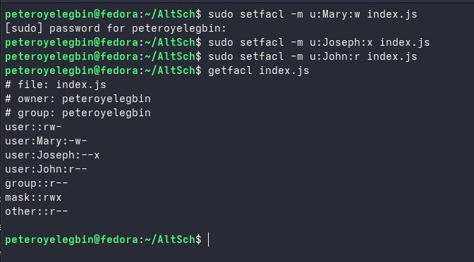

# Month 1 (Assignment 4)
**Instruction:**
1. Find out the command for checking running processes on your terminal. List out any five processes you see and what they do for your system. Your opinion on if they are important processes.
2. Create three users — Mary, Joseph, and John on your Linux system. Then create a file — index.js (you can use placeholder texts in the file or any other content, very short). Give each user different privileges/permissions to the file. (Read, Write, Execute).

**Result:**
1. The comand for checking running process is `top`.
   

   Below is the list of 5 running processes on my system as seen in the snapshot below;
   a. gnome-shell
      - Function: It manages the GNOME desktop environment’s graphical interface, and window management.
      - Important: Yes
   b. chrome
      - Function: Google Chrome browser processes (main app, tabs, or extensions)
      - Important: No
   c. polkitd
      - Function: It is used for managing system-wide privileges (e.g., authorization prompts)
      - Important: Yes
   d. systemd
      - Function: It manages services, boot-up, and shutdown.
      - Important: Yes
   e. dropbox
      - Function: Dropbox cloud sync client
      - Important: No

2. Create three users — Mary, Joseph, and John on your Linux system.
   

   Then create a file — index.js (you can use placeholder texts in the file or any other content, very short).
   

   Give each user different privileges/permissions to the file. (Read, Write, Execute).
   
