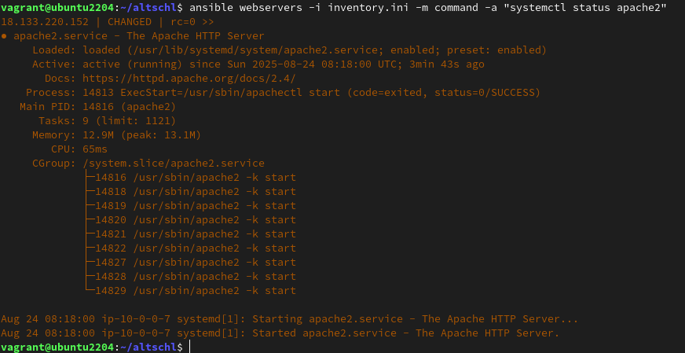
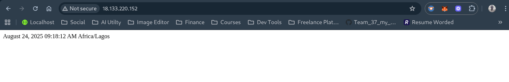

# ✨ Month 2 (Assignment 2)
Create an Ansible Playbook to setup a server with Apache. The server should be set to the Africa/Lagos Timezone. Host an index.php file with the following content, as the main file on the server:
```php
<?php
date("F d, Y h:i:s A e", time());
?>
```


## 🖊 Instruction
- Submit the Ansible playbook, the output of systemctl status apache2 after deploying the playbook and a screenshot of the rendered page.


## 🚀 Result
1. Installing Ansible using the command below.
  ```bash
  sudo apt update
  sudo apt install python3 python3-pip -y
  pip3 install ansible
  ```

2. Configuring Ansible Inventory [inventory content](./inventory.ini).

3. Testing Connection using the command below;
  ```bash
  ansible webservers -m ping -i inventory.ini
  ```

4. Creating the Ansible Playbook file called apache-playbk.yml [playbook content](./apache-playbk.yml)

5: Preparing the index.php File
Create an index.php file in your project directory with the [php content](./index.php)

6. Running the Playbook by running the following command
  ```bash
  ansible-playbook -i inventory.ini apache-playbk.yml
  ```

7. Check Apache status using the following command
  ```bash
  ansible webservers -i inventory.ini -m command -a "systemctl status apache2"
  ```
  

8. Accessing Your Server
  Open your web browser and navigate to your server's IP address. You should see output similar to:
  


## 📑 Resources Used
[Set up the inventory file](https://docs.ansible.com/ansible/latest/getting_started/get_started_inventory.html)

[Configure ansible playbook](https://docs.ansible.com/ansible/latest/getting_started/get_started_playbook.html)
