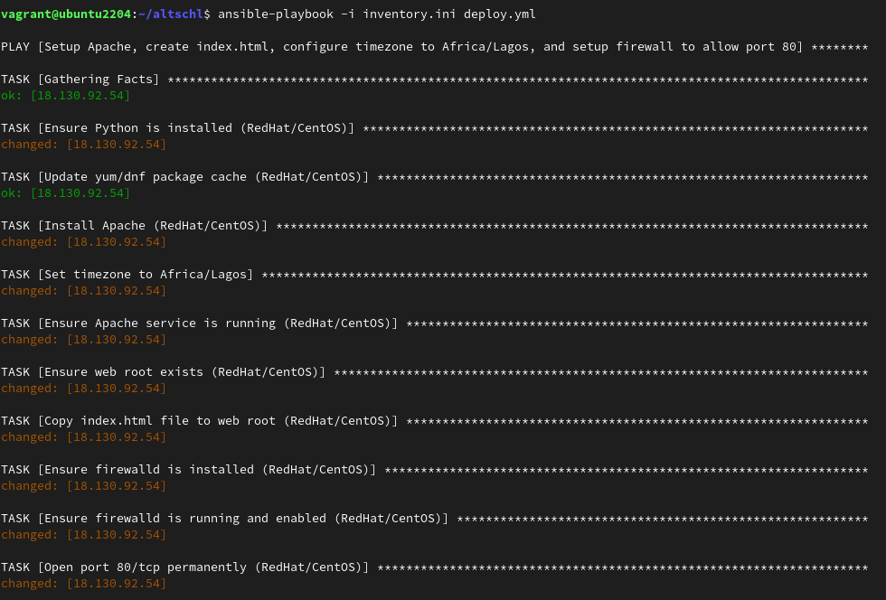
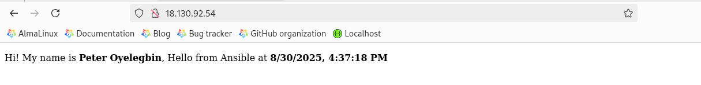

# ✨ Month 2 (Assignment 3)
Using Ansible, automate the setup of a basic web server environment. This assignment touches all the core areas of Ansible (inventory, modules, playbooks, idempotency, service management, config changes, firewall rules).
It also touches on previous topics we have learned about such as Package management (install Apache), File management (customize and deploy index.html), System configuration (set timezone), System/Service management (ensure Apache runs on boot), Security/firewall (open port 80). It will force you to think as a DevOps/Cloud/automation engineer.


## 🖊 Instruction
- Write an Ansible inventory file with one host (your managed node).
- Write a playbook that:
    - Installs Apache
    - Deploys a custom index.html that says “Hi! My name is (Your name), Hello from Ansible”
    - Sets the server to the Africa/Lagos Timezone
    - Ensures the service is started and enabled on boot (systemd)
    - Opens port 80 (HTTP) in the firewall to allow Apache serve the web pages.
- Submit screenshots of your playbook, your playbook running, and the deployed index.html file


## 🚀 Result
1. Installing Ansible using the command below.
  ```bash
  sudo dnf update
  sudo dnf install python3 python3-pip -y
  pip3 install ansible
  ```

2. Configuring Ansible Inventory [inventory content](./inventory.ini).

3. Testing Connection using the command below;
  ```bash
  ansible webservers -m ping -i inventory.ini
  ```

4. Creating the Ansible Playbook file called apache-playbk.yml [playbook content](./deploy.yml)

5: Preparing the index.html File
Create an index.html file in your project directory with the [html content](./index.html)

6. Running the Playbook by running the following command
  ```bash
  ansible-playbook -i inventory.ini deploy.yml
  ```
  

7. Accessing Your Server
  Open your web browser and navigate to your server's IP address. You should see output similar to:
  


## 📑 Resources Used
[Set up the inventory file](https://docs.ansible.com/ansible/latest/getting_started/get_started_inventory.html)

[Configure ansible playbook](https://docs.ansible.com/ansible/latest/getting_started/get_started_playbook.html)
