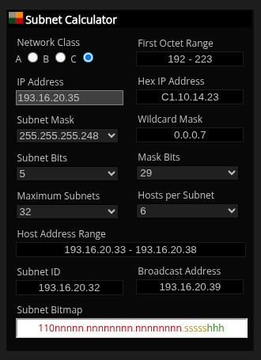

# Month 3 (Assignment 1)
193.16.20.35/29 What is the Network IP, number of hosts, range of IP addresses and broadcast IP from this subnet?


## Instruction
* Submit all your answer as a markdown file in the folder for this exercise.


## Result
- Network IP
  ``` 193.16.20.32/29 ```

- Number of Host
  ``` 6 ```

- Range of IP Addresses
  ``` 193.16.20.33 - 193.16.20.38 ```

- Broadcast IP
  ``` 193.16.20.39 ```


## 📑 Resources Used

