# Month 1 (Assignment)
You are working as a junior cloud engineer at TechCorp, and your team needs to deploy a new web application infrastructure on AWS. The senior engineer has provided you with the requirements below. You need to create a complete Terraform configuration that provisions the required infrastructure.

## Business Requirements:
TechCorp is launching a new web application that needs:
- High availability across multiple availability zones
- Secure network isolation with public and private subnets
- Load balancing for web traffic
- Bastion host for secure administrative access
- Scalable architecture that can grow with the business
[View more detailed requirements](./Requirements.md)

---

## Deployment steps
1. Initialize Terraform:
```bash
terraform init
```

2. Validate and see plan:
```bash
terraform plan
```
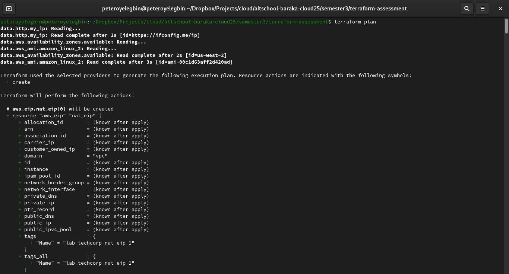

3. Apply:
```bash
terraform apply
```
**Note: Approve the apply prompt or add -auto-approve if you understand the changes.**
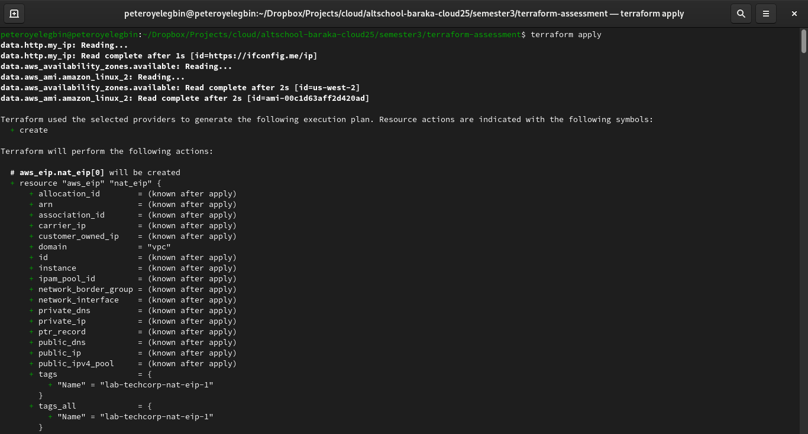

4. After apply completes:
    - Outputs printed include vpc_id, alb_dns_name, and bastion_public_ip.
    - ALB DNS (http) should serve the simple HTML page created by the web servers.
    - Use the bastion host to SSH into private web and db servers.
    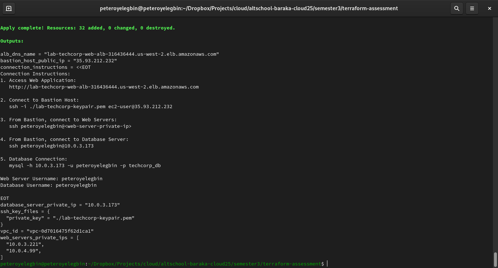

---

## Verify Deployment
1. AWS Console showing created resources
    - 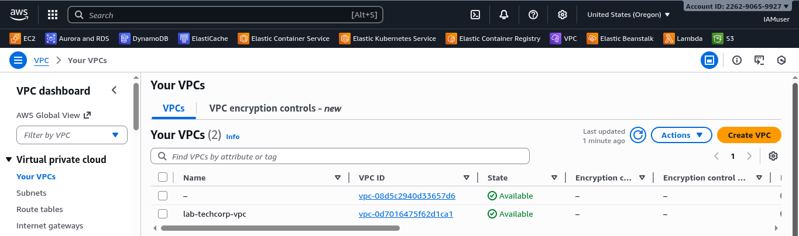
    - 
    - 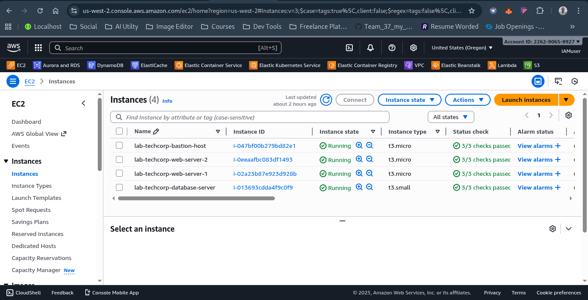
    - 
    - 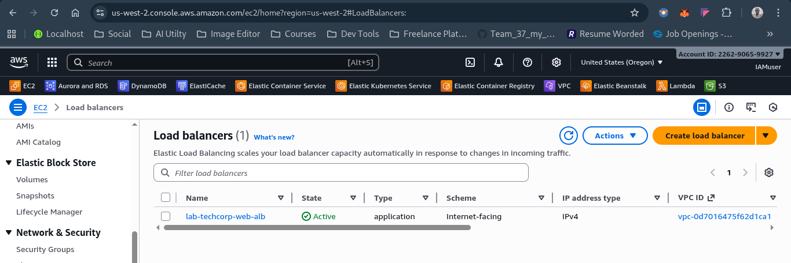
    - 

2. ALB serving web content
This displays both web content 1 and web content 2 simultaneously on reload.


2. SSH into bastion
```bash
ssh -i /path/to/key.pem ec2-user@<bastion_public_ip>
```


3. From bastion, SSH into a web server (private IP visible in AWS Console)
```bash
ssh ec2-user@<web_private_ip>
```
**Note: Use the web_password you set**
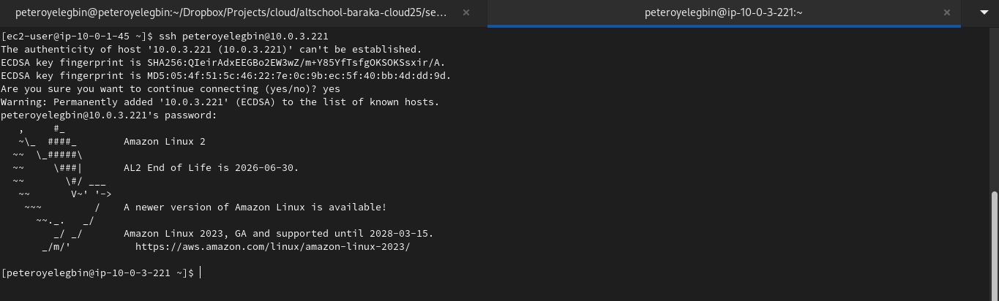
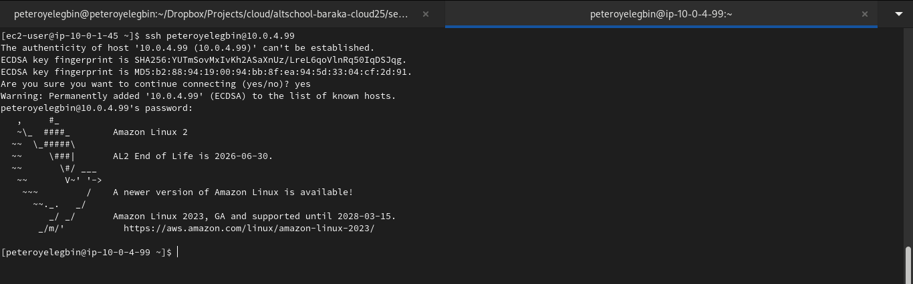

4. Database access
From the web server, connect to Postgres:
```bash
mysql -h 10.0.3.x -u techcorpuser -p techcorp_db
```
**password: value of db_password**
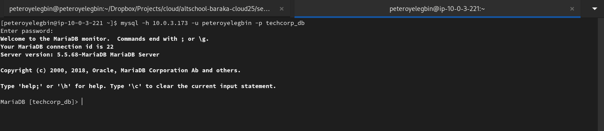
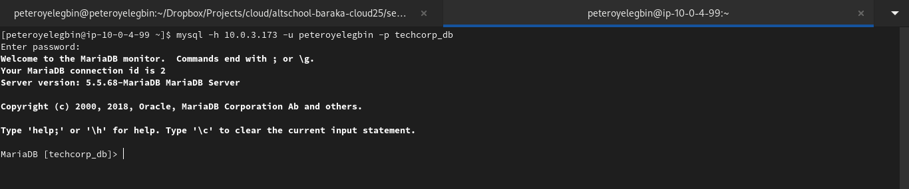

5. From bastion, SSH into a Db server (private IP visible in AWS Console)
```bash
ssh ec2-user@<db_private_ip>
```
**Note: Use the db_password you set**


---

## Cleanup / Destroy
To remove everything:
```bash
terraform destroy
```
Confirm the destroy prompt or append -auto-approve.
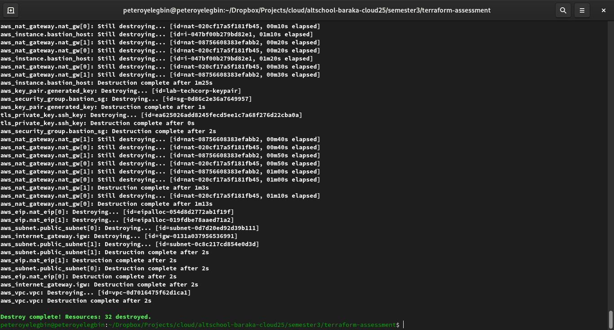
